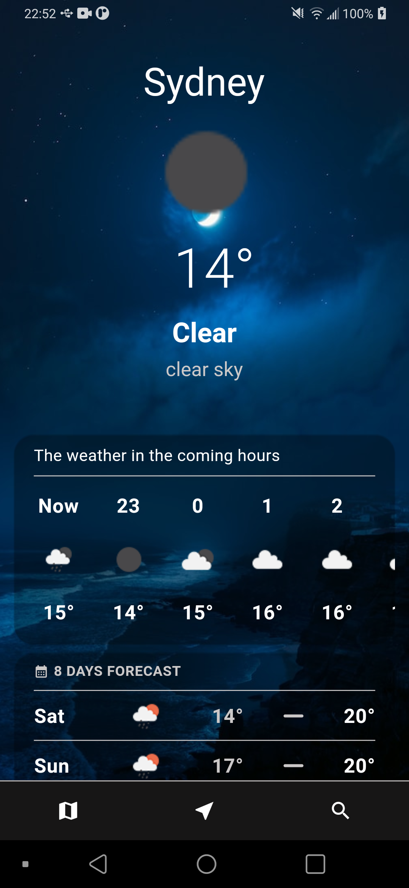

# Flutter Weather App

## Getting Started

### Core functions:
 - Show the details of the current weather, forecast in 8 days and forecast in 24 hours
 - Allow to pick a location on the Google Map and show the weather details
 - Allow to show the weather details of the current location
 - Allow to search for a location and show the weather details of that location

### Weather API:
 - Openweathermap (https://openweathermap.org/api)
 - WeatherAPI (https://www.weatherapi.com/)

### Demo

